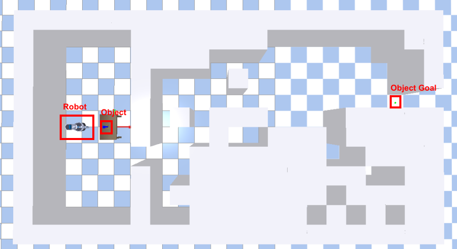

# Default-Course-Project
Default Course Project of CS4278/CS5478 Intelligent Robots: Algorithms and Systems

In this project, the task is to:

1. Generate antipodal grasp proposals, solve IK, and pick up an object on the table.
2. Carry the object and navigate the robot through the maze. 
3. Bring the object to the target position (visualized as the green sphere). 

We provide an environment code for the robot in `pick_nav_reach.py`.



# Requirement

You should implement the grasp generation, motion planning, and navigation algorithms by yourself to accomplish the task.

# Rubric (TODO)

We evaluate your algorithms in the following three aspects with 5 Unprovided seeds:

- Grasp Generation: 5 test objects.

- Motion Planning: use the grasps produced above.

- Navigation: 5 test mazes.

Unless otherwise stated: placement tolerance = **5 cm**

## Grasp Generation (40%)

Use the **object point cloud and surface normals** to generate grasps.

- Force-Closure Validity — 25 pts

    For each object, take your chosen grasp (e.g., top-1 after your internal scoring) and test force closure using friction cones on the contact pair(s).
    Scoring per trial: FC passes → 5 pts.

    Notes: Default friction μ = 0.5 unless you document another value.

- Table Feasibility — 10 pts

    Evaluate the fraction of the gripper volume above the table plane (feasible ratio) when executing the grasp from the table top. You may approximate volume via uniform point sampling on the gripper geometry.
    Scoring per trial: 2 pts * feasible ratio


- Visualization — 5 pts

    Provide a clear visualization of generated grasps (e.g., gripper pose, object pose and contact normals/arrows). Scoring: present & clear → 5 pts.

## Motion Planning and Grasping (20%)

From the selected grasps above, perform IK + motion planning to execute pre-grasp → grasp → lift.

For each trial, award the following (sum; then average across trials):

- Lift within 300 sim steps — 5 pts

- Lift height ≥ 10 cm above table — 5 pts

- Hold stability for ≥ 50 steps — 5 pts

- Final pose close to target grasp — 5 pts

## Navigation (40%)

Evaluate on 5 test mazes while carrying the object toward the green goal sphere.

- Delivery to Goal — 30 pts

    Scoring per trial: reach within 5 cm of the goal sphere while still holding the object → 6 pts.

- Collision Count — 5 pts

    Total contacts with walls/static scene across 5 trials:

    - 0–3 contacts → 5 pts

    - 4–10 → 3 pts

    - \>10 → 0 pts

- Carry Stability — 5 pts

    Scoring per trial: no drop that requires re-grasp during navigation → 1 pt each; sum over 5 trials (max 5).

# Installation

1. Our environment is build on [PyBullet](https://pybullet.org/wordpress/index.php/forum-2/). Install it with pip:

```
pip3 install pybullet numpy matplotlib trimesh
```

2. Clone the project repo:

```
git clone https://github.com/NUS-LinS-Lab/Pick-Nav-Reach-Default-Project.git
```

# Run the Environment 

`python run.py`

# References

- [PyBullet Quickstart Guide](https://docs.google.com/document/d/10sXEhzFRSnvFcl3XxNGhnD4N2SedqwdAvK3dsihxVUA/edit?tab=t.0#heading=h.2ye70wns7io3).

# Acknowledgments

- YCB object models are chosen and adapted from [here](https://www.ycbbenchmarks.com/).
